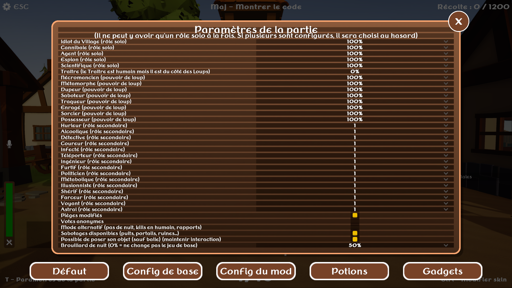

# FR

## Résumé
- Tous les rôles sont expliqués dans le jeu en maintenant la touche pour s'accroupir - pas besoin de les mémoriser
- 13 nouveaux rôles secondaires qui peuvent apparaître en plus du rôle principal : vous pouvez être le "Villageois - Hurleur" qui peut augmenter la portée de sa voix, le "Loup - Alcoolique" qui peut boire les potions en forme de loup pour se soigner...
- 4 rôles principaux "solitaires" qui ne sont ni avec les villageois ni avec les loups : ils gagnent seuls et ont un objectif spécifique
- 4 rôles de Loups spéciaux qui remplacent les Loups habituels (comme le Chasseur qui remplacerait un Villageois), ainsi qu'un rôle de Traître (humain mais allié avec les loups)
- Modifications des pièges qui peuvent désormais être désarmés et ont besoin d'un petit délai pour être posés
- Une option de vote aléatoire
- Une option de mode alternatif (nom de code "Amogus")
- Et quelques améliorations diverses : les gens qui passent le vote s'accroupissent, la voix des loups est modifiée aléatoirement...
- Presque tout est configurable
- Des bugs sont toujours possibles mais le mod est testé depuis un bon moment sur le Discord officiel

## Rôles secondaires (sont donnés en plus du rôle principal - sauf au Chasseur)
* La plupart des pouvoirs actifs des rôles secondaires ont un temps de recharge

Hurleur : Il peut augmenter la portée de sa voix au niveau de celle d'un Géant. De plus, un Loup Hurleur peut hurler pour étourdir TOUS les villageois et les ralentir temporairement.

Alcoolique : Les effets négatifs et neutres des potions sont remplacés par un effet positif aléatoire, et les potions durent plus longtemps sur lui. De plus, un Loup Alcoolique peut prendre et boire les potions en forme de Loup pour se soigner !

Détective : Il peut Inspecter quelqu'un pour savoir s'il a tué depuis la dernière nuit. De plus, il sait qui est le Chasseur.

Coureur : Il peut activer Course à volonté pour obtenir une Célérité de 5 secondes, mais cela fait rapidement baisser sa satiété (sauf s'il est Loup). De plus, un Loup Coureur peut, en forme de loup, Foncer pour aller vraiment vite pendant un court instant.

Infecté : Si c'est un Villageois et qu'il est tué par un Loup, il force ce Loup à se détransformer après un délai (le Loup est averti). S'il est Loup, il peut, en forme de loup, Infecter les villageois proches (même à travers les murs) pour les faire flatuler et les repérer plus facilement !

Téléporteur : Il peut inverser l'état de tous les portails - activer ceux qui sont inactifs et désactiver ceux qui sont actifs. De plus, un Loup Téléporteur se téléporte silencieusement quand il se détransforme et devient temporairement invisible.

Ingénieur : Il peut créer un gadget aléatoire. De plus, les pièges l'immobilisent moins longtemps et il les désarme plus vite, il casse les verrous plus vite, et les fumigènes ont une zone réduite pour lui.

Furtif : Il peut devenir Furtif pour être invisible et camoufler le bruit de ses pas, mais dans cet état il ne peut pas courir. De plus, un Loup Furtif est repéré de moins loin quand il est en forme de loup.

Politicien : En journée, il peut forcer un joueur à passer son prochain vote. De plus, s'il est Villageois, son vote compte double et s'il obtient la majorité c'est quelqu'un d'autre au hasard qui meurt à sa place !

Métabolique : S'il est Villageois, sa barre de faim descend plus lentement. S'il est Loup, il peut secrètement maudire quelqu'un pendant la journée, ce qui lui drainera rapidement sa faim tout au long de la prochaine nuit !

Illusionniste : S'il est Villageois, il peut aveugler brièvement tous les loups transformés. S'il est Loup, il peut mélanger l'apparence de tous les joueurs pour semer la zizanie !

Shérif : En utilisant une balle, il peut tenter de tuer quelqu'un... mais si sa cible est dans le camp des Villageois, c'est lui qui meurt à sa place ! De plus, un Loup Shérif résiste légèrement mieux aux balles du Chasseur - suffisamment pour courir encore quelques secondes.

Farceur : Il peut échanger sa position avec celle d'un autre joueur choisi au hasard. De plus, s'il meurt, il y a une chance pour qu'un autre joueur aléatoire meurt également.

## Nouveaux rôles principaux
Idiot du Village (rôle solitaire) : Il gagne uniquement et immédiatement s'il se fait voter pendant la phase de discussion. Il a faim plus lentement, mais rester inactif trop longtemps lui donne faim.

Cannibale (rôle solitaire) : Il peut manger les cadavres (même ceux de Loups) et il gagne s'il en mange suffisamment. Ils lui donnent l'effet Rassasié et il ne peut pas manger de cadavre tant qu'il est Rassasié.

Agent (rôle solitaire) : Il gagne en volant la victoire aux Loups, et il sait qui ils sont... mais les Loups savent qu'il y a un Agent, et ils peuvent l'identifier pendant le jeu.

Espion (rôle solitaire) : Il reçoit des cibles à espionner (nom en rouge dans la liste des joueurs). Il gagne s'il réussit à espionner suffisamment de fois.

Traître (rôle spécial) : C'est un humain parfaitement ordinaire... sauf qu'il est secrètement du côté des Loups.

Corrupteur (remplace un Loup) : Une fois uniquement, il peut convertir un villageois en Traître, ce qui donne une indication sonore à tout le monde. Sa transformation est plus lente.

Métamorphe (remplace un Loup) : Il se transforme plus rapidement et peut se transformer à volonté pendant la nuit, mais en forme de loup il a faim un peu plus rapidement. La détransformation ne lui rend pas sa vie mais il régénère tant qu'il est en forme humaine.

Dupeur (remplace un Loup) : S'il est présent, des illusions auditives de transformation seront créées tout au long de la nuit afin de brouiller les pistes.

Terrifiant (remplace un Loup) : Sa transformation ralentit tous les joueurs proches et les empêche d'activer leur pouvoir secondaire, mais ses victimes lui rendent moins de santé.

---------------------------------

# EN

## Summary
- All roles are explained by holding the Crouch key - no need to remember them!
- 13 new secondary roles that can be assigned in addition to the main role: you can be a "Villager - Howler", able to raise your voice range once per day, or a "Wolf - Alcoholic", able to drink potions in Wolf form to heal yourself...
- 4 "Solo" roles that side neither with the villagers nor the wolves - they have a specific win condition
- 4 Special Wolf roles that replace a regular Wolf (like the Hunter would replace a Villager), as well as a Traitor role
- Trap changes: they can now be disarmed and require a small time to set up
- Option for anonymous votes
- Option for alternate gamemode (codename "Amogus")
- Various other improvements: players now crouch when passing their vote, wolf form voice is changed randomly...
- Almost everything can be configured
- Bugs may still exist but the mod has been tested a lot

## Secondary roles (given in addition to the main role - Hunter does not get one)
* Most active powers for secondary roles have a cooldown

Howler: He can increase the range of his voice like a Giant. In addition, a Howler Wolf can howl to stun ALL villagers and slow them

Alcoholic: Negative and neutral potion effects are replaced with random positive ones, and they last longer on him. In addition an Alcoholic Wolf can take and drink potions while in wolf form to heal!

Detective: He can Inspect someone to know whether they've killed since the latest night. In addition, he knows who the Hunter is.

Sprinter: He can activate Sprint at will to become faster, but this rapidly drains his hunger bar. In addition, a Sprinter Wolf can, in wolf form, Chase to get really fast for a short moment.

Infected: If he's a Villager and is killed by a Wolf, he forces that Wolf to untransform after a while (the Wolf is notified of this). If he's a Wolf, in wolf form, he can Infect nearby villagers to make them fart and find them more easily!

Teleporter: He can invert the state of all portals - activating inactive ones and deactivating active ones. In addition, if he's a Wolf, untransforming silently teleports him and makes him invisible for a short while.

Engineer: He can create a random gadget. In addition, traps have less duration on him and he disarms them faster, he breaks locks faster, and smoke bombs have a lower radius for him.

Stealther: He can become Stealthed to be invisible and have silent footsteps, but he can't run in this state. In addition, a Stealther Wolf is detected from less far while in wolf form.

Politician: During daytime, he can force a player to pass for their next vote. In addition, if he's a Villager his vote counts double and if he would be voted out then someone else dies instead!

Metabolic: If he's a Villager, his hunger bar decreases slower. If he's a Wolf, he can secretly mark someone during the day to make them starve during the next night!

Illusionist: If he's a Villager, he can blind all transformed Wolves for a short time. If he's a Wolf, he can shuffle the appearence of all players!

Sherif: Using a bullet, he can attempt to kill someone... but if their target is on the Villager side, then the Sherif dies instead! In addition, a Sherif Wolf is slightly resistant to bullets and can still run for a few seconds after being hit by one.

Trickster: He can switch his position with a random player's. In addition, if he dies, there's a chance that another random player also dies.

## New primary roles
Village Idiot (solo role): He wins if he get's voted out during a meeting. He gets hungry slower but staying inactive makes him very hungry.

Cannibal (solo role): He can eat corpses (even Wolf corpses) and he wins if he eats enough of them. They give him the Satiated effect, and he cannot eat while Satiated.

Agent (solo role): He wins by stealing victory from the Wolves. He knows who they are, but they can also identify him during the game!

Spy (solo role): He gets targets to spy on (red name in the player list) and wins if he manages to Spy enough times.

Traitor (special role): He's a perfectly ordinary human... but he sides with the Wolves.

Corrupter (Wolf role): Once only, he can convert a villager into a Traitor. His transformation is slower.

Shapeshifter (Wolf role): He transforms faster and can transform at will during the night, but he gets hungry slightly faster in Wolf form. Untransforming does not heal him but he regenerates while in Human form.

Deceiver (Wolf role): If he's present, illusions of transformations will be created through the night, confusing villagers.

Dreaded (Wolf role): When he transforms, nearby players are slowed and are unable to activate their secondary role power. His victims heal him less.